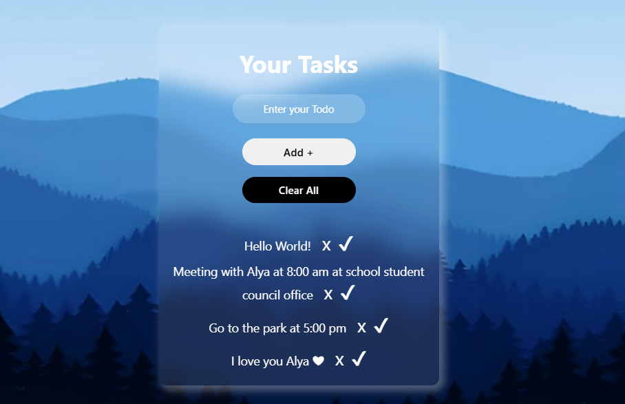

# 📝 Your Tasks – Simple & Elegant Todo App



### 🌐 Live Demo  
👉 **[Visit App on Netlify](https://todolistapp-nurnabikhan.netlify.app/)**  

---

### 🌄 Overview
**Your Tasks** is a clean, minimal, and peaceful Todo App built using **HTML, CSS, and Vanilla JavaScript**.  
It helps you organize your daily thoughts and tasks with a smooth and calm anime-inspired interface.  

This project reflects both **logic and creativity** — written fully by hand, combining strong JavaScript logic and a soft UI design inspired by *Alya Sometimes Hides Her Feelings in
Russian* 💙  

---

### 🚀 Features
- ➕ Add new tasks instantly  
- ✅ Mark tasks as completed  
- ❌ Delete individual tasks  
- 🧹 Clear all tasks with one click  
- 💾 Automatically saved in **Local Storage**   
- 🌈 Elegant glassmorphism UI  

---

### 💻 Tech Stack
- **HTML5**
- **CSS3 (Glassmorphism + Responsive Design)**
- **JavaScript (DOM Manipulation + Loop + LocalStorage)**

---

### 📂 Folder Structure

```
├── index.html
└── src
├── style.css
├── script.js
└── TodoAppBanner.png
```

---

### ⚡ How It Works
1. Type your task in the input box.  
2. Click **Add +** to save it.  
3. Click ✅ to mark as complete or ❌ to delete it.  
4. Click **Clear All** to remove everything.  

All tasks are automatically saved in **LocalStorage**,  
so your list remains even after refreshing the page.  

---

### 🌸 Developer Note
> “Every task you complete brings you one step closer to mastering your focus —  
> just like every line of code strengthens your logic.”  

Made with 💙 by **[Nur Nabi Khan](https://github.com/nurnabi7002)**  
---
